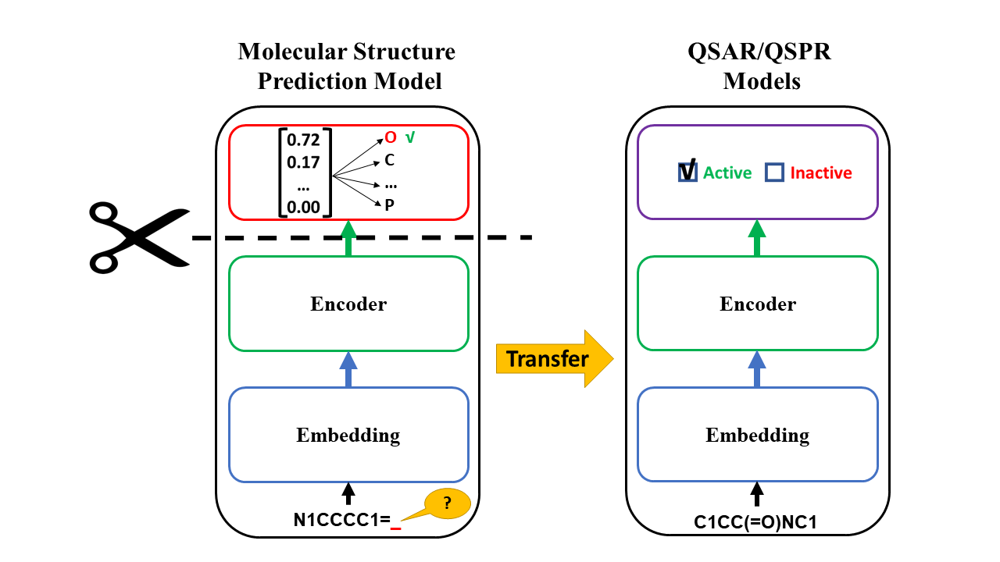

# MolPMoFiT

Implementation of [**Inductive transfer learning for Molecular Activity Prediction: Next-Gen QSAR Models with MolPMoFiT**](https://jcheminf.biomedcentral.com/articles/10.1186/s13321-020-00430-x)

**Mol**ecular **P**rediction **M**odel **Fi**ne-**T**uning (**MolPMoFiT**) is a transfer learning method based on self-supervised pre-training + task-specific fine-tuning for QSPR/QSAR modeling. 

MolPMoFiT is adapted from the [ULMFiT](https://arxiv.org/abs/1801.06146) using Pytorch and [Fastai v1](https://github.com/fastai/fastai). A large-scale molecular structure prediction model is pre-trained using one million unlabeled molecules from ChEMBL in a self-supervised learning manner, and can then be fine-tuned on various QSPR/QSAR tasks for smaller chemical datasets with a specific endpoints.




## Enviroment

We recommand to build the enviroment with `Conda`.

```
conda env create -f molpmofit.yml
```

## Datasets

We provide all the datasets needed to reproduce the experiments in the `data` folder.

 - `data/MSPM` contains the dataset to train the general domain molecular structure prediction model.
 - `data/QSAR` contains the datasets for QSAR tasks.

## Experiments

The code is provided as `jupyter notebook` in the `notebooks` folder. All the code was developed in a Ubuntu 18.04 workstation with 2 Quadro P4000 GPUs.

1. `01_MSPM_Pretraining.ipynb`: Training the general domain molecular structure prediction model(MSPM).
2. `02_MSPM_TS_finetuning.ipynb`: (1) Fine-tuning the general MSPM on a target dataset to generate a task-specific MSPM model. (2) Fine-tuning the task-specific MSPM to tran a QSAR model.
3. `03_QSAR_Classifcation.ipynb`: Fine-tuning the general domain MSPM to train a classification model.
4. `04_QSAR_Regression.ipynb`: Fine-tuning the general domain MSPM to train a regression model.

## Pre-trained Models Download
1. Download [ChEMBL_1M_atom](https://figshare.com/ndownloader/files/36898600). See `notebooks/05_Pretrained_Models.ipynb` for instructions of usage.
    - This model is trained on 1M ChEMBL molecules with the atomwise tokenization method (original MoPMoFiT). 
    
2. Download [ChEMBL_1M_SPE](https://figshare.com/ndownloader/files/36910486). See `notebooks/06_SPE_Pretrained_Models.ipynb` for instructions of usage.
    - This model is trained on 1M ChEMBL molecules with the SMILES pair encoding tokenization method.
    - [SMILES Pair Encoding](https://github.com/XinhaoLi74/SmilesPE) (SmilesPE) is A Data-Driven Substructure Tokenization Algorithm for Deep Learning.
